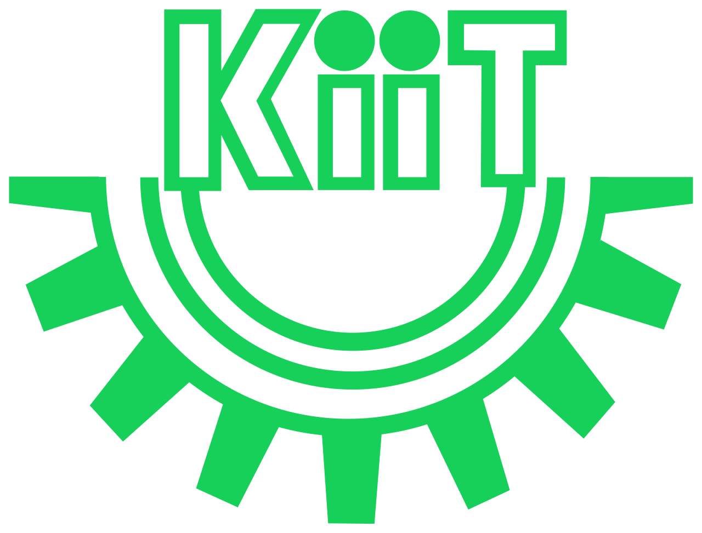

<h1 align="center">
   Hi, I'm Bibek
</h1>

  <i>A computer science student from Nepal, fueled by Nepali tea and coffee, with a lifelong habit of taking systems apart to see how they work.</i>

---

### 💻 My Journey
My introduction to tech didn't start with textbooks; it started around age 14 by fixing broken laptops and flashing custom OS ROMs just to experiment. I built my early programming foundation writing **C**, and while some of my earliest projects (like custom WireGuard VPNs) were heavily "vibe coded" with AI tools, my focus right now is on mastering the underlying engineering. 

I am actively transitioning from surface-level tutorials to deeply understanding **backend systems, cloud infrastructure, and offensive security**.

### 🎓 Education

<b>Kalinga Institute of Industrial Technology (KIIT), Bhubaneswar</b>  
<i>B.Tech in Computer Science and Engineering (2024 — 2028)</i>   

<b>Bal Kalyan Vidhya Mandir (BKVM), Biratnagar</b>  
<i>+2 Science (Computer Science) under NEB</i>   

### 🛠️ Current Tech Stack

  

### 🕹️ Beyond the Terminal
When I'm not studying Data Structures & Algorithms or spinning up AWS instances:
- ☕ **Fuel:** You'll usually find me running on copious amounts of coffee and Nepali tea.
- 🎮 **Gaming:** I have a background in esports, but these days I just enjoy playing across mobile, PC, and console for fun.
- 🍿 **Media:** Always down for a good movie, series, or anime.

---

### 📊 GitHub Activity

